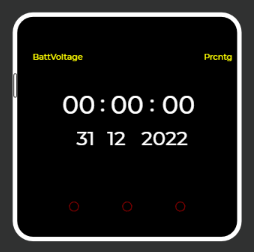
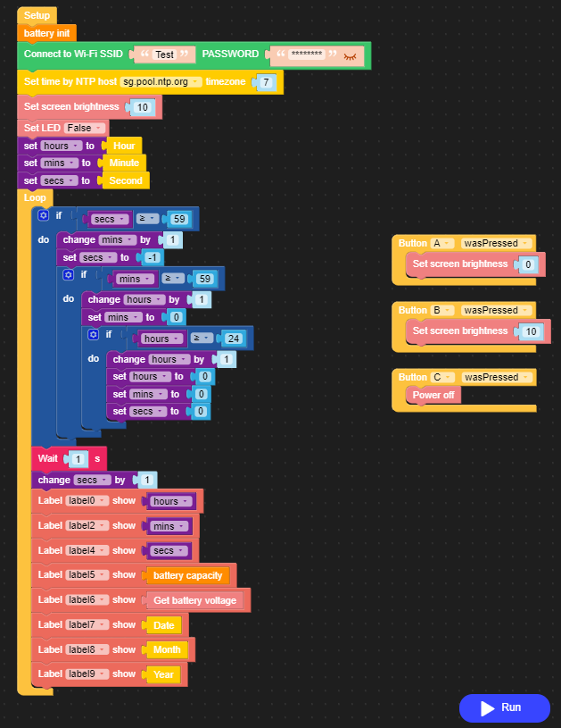

# Night clock simple

This project show time and date also use the custom blockly for battery capacity in percentage.

# How to use:
- Open https://flow.m5stack.com/
- Connect to yours M5 device
- Before you open [Watch.m5f](Watch.m5f) you must add custom blockly first [battery.m5b](battery.m5b) **Important**

